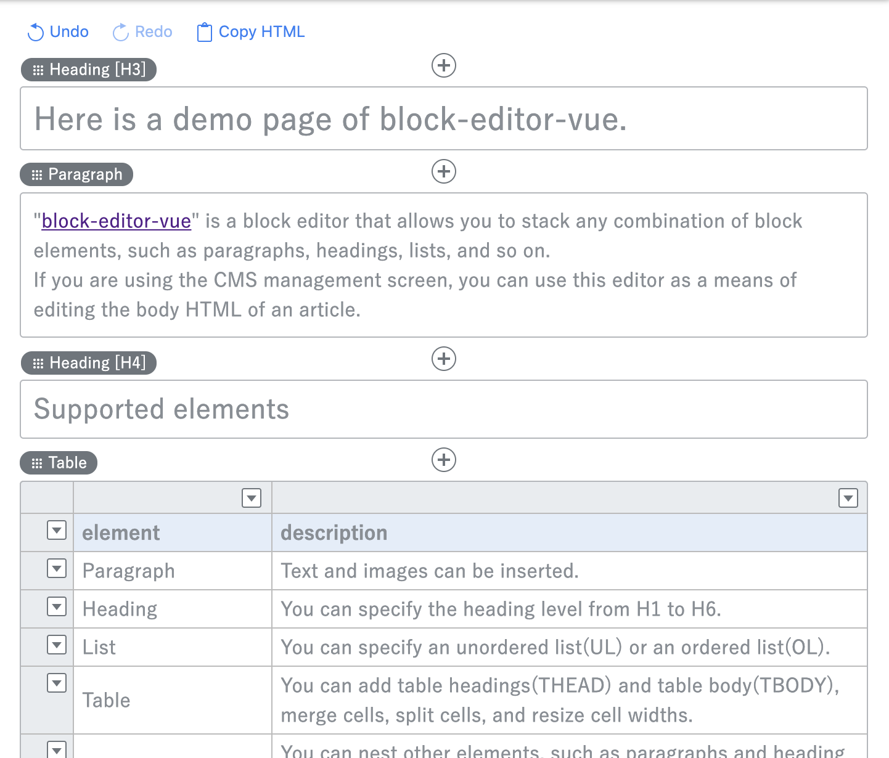

# block-editor-vue

[日本語はこちら](README.ja.md)

"block-editor-vue" is a block editor that allows you to stack any combination of block elements, such as paragraphs, headings, lists, and so on.  
Editing content is more flexible when using a WYSIWYG editor such as CKEditor or TinyMCE, but you need to get used to it because you can't move elements intuitively, and garbage markup remains when you delete elements.  
Also, if you want to disclose the CMS management screen to a third party, you may need to limit the types of markup that can be used in the page. (For example, you want to allow only headlines, subheadings, and text, but not tables.)
I have created a tool for editing HTML markup that is as easy to use as possible and that allows you to set programmable limits on the elements you use.  

<p align="center">
  <br>
  <a href="https://codepen.io/takitakit/pen/VOabaN" target="_blank"></a>
  <br>
</p>

## Build

```
npm install
npm run build
```

## Demo

[Codepen](https://codepen.io/takitakit/pen/RmpVKL)

## Usage

### Step 1: Link the library to an HTML file

```
<script src="block-editor-vue.js"></script>
```

### Step 2: Create a starting HTML markup

#### When you want to input and output data via the INPUT tag

```
<input name="content" id="editor" type="hidden" value="(Escaped HTML markup)">
```

The editor receives the HTML markup data set for value attribute and performs the initial display. HTML markup data must have a specific structure for each type.  
*to use this feature, set "loadItemsFromInputTag" option true.

#### When you want to use only the editor without INPUT tag

```
<div id="editor"></div>
```

### Step 3: Start the library

```
new BlockEditor('#editor');
```

When to Set Options
```
new BlockEditor('#editor', {rootClass: 've'});
```

## Options

### Format
```
new BlockEditor(<element selector>, <options>);
```
For non-Common options, specify the object whose key is each section name.

Example
```
new BlockEditor('#editor', {
  // Common options
  rootClass: 've',

  // Paragraph options
  Paragraph: {
    defaultImageAlign: 'right'
  }
});
```

- [Common](#common)
  - [rootClass](#rootclass)
  - [baseFontSize](#basefontsize)
  - [loadItemsFromInputTag](#loaditemsfrominputtag)
  - [allowStyledText](#allowstyledtext)
  - [styledTextClasses](#styledtextclasses)
  - [allowCssClass](#allowcssclass)
  - [cssClasses](#cssclasses)
  - [enabledItemNames](#enableditemnames)
  - [itemOrder](#itemorder)
  - [enabledItemNamesInColumn](#enableditemnamesincolumn)
  - [setAsHtmlIfNotMatched](#setashtmlifnotmatched)
  - [items](#items)
  - [allowImages](#allowimages)
  - [imageExtensions](#imageextensions)
  - [maxImages](#maximages)
  - [allowFileBrowser](#allowfilebrowser)
  - [allowHistories](#allowhistories)
  - [historyMax](#historymax)
  - [historyMinInterval](#historymininterval)
  - [historyMaxWait](#historymaxwait)
  - [outputNewLine](#outputnewline)
  - [outputIndent](#outputindent)
  - [locale](#locale)
- [Paragraph](#paragraph)
  - [defaultImageAlign](#defaultimagealign)
  - [tagName](#tagname)
  - [tagClassName](#tagclassname)
  - [dispName](#dispname)
  - [presets](#presets)
- [Heading](#heading)
  - [levels](#levels)
  - [defaultLevel](#defaultlevel)
  - [levelNames](#levelnames)
  - [dispName](#dispname-1)
  - [presets](#presets-1)
- [List](#list)
  - [types](#types)
  - [defaultType](#defaulttype)
  - [maxRows](#maxrows)
  - [dispName](#dispname-2)
  - [presets](#presets-2)
- [Table](#table)
  - [maxRow](#maxrow)
  - [minRow](#minrow)
  - [defaultRowNum](#defaultrownum)
  - [maxCol](#maxcol)
  - [minCol](#mincol)
  - [defaultColNum](#defaultcolnum)
  - [dispName](#dispname-3)
  - [presets](#presets-3)
- [Column](#column)
  - [allowChangeNumColumn](#allowchangenumcolumn)
  - [maxColumn](#maxcolumn)
  - [minColumn](#mincolumn)
  - [defaultNumColumn](#defaultnumcolumn)
  - [tagName](#tagname-1)
  - [tagClassName](#tagclassname-1)
  - [columnTagName](#columntagname)
  - [columnTagClassName](#columntagclassname)
  - [dispName](#dispname-4)
  - [presets](#presets-4)
- [Html](#html)
  - [tagName](#tagname-2)
  - [tagClassName](#tagclassname-2)
  - [dispName](#dispname-5)
  - [presets](#presets-5)
- [Events](#events)
  - [onLoad](#onload)
  - [onUpdate](#onupdate)
- [About presets](#about-presets)

### Common
#### rootClass

The CSS class name of the root element that contains all the elements of the generated HTML.  
By default, HTML has the following markup:

```
<div class="ve">...(HTML of the enclosing element)...</div>
```

```
type: string
default: 've'
```

#### baseFontSize

The font size (px) on which to base the editor display.

```
type: integer
default: 16
```

#### loadItemsFromInputTag

Whether the block element configuration is read from the input tag when the editor is started.  
Use this if you post HTML markup from another page and want to edit it in the editor.  
When true, if you specify input as the editor's starting point, for example, the headings and paragraphs will be imported as the initial state.

```
<input type="hidden" value="&lt;h3&gt;Heading&lt;/h3&gt;
&lt;div class=&quot;paragraph-wrap&quot;&gt;Text in Paragraph&lt;/div&gt;">
```

```
type: boolean
default: true
```

#### allowStyledText

Whether inline styled text editing is allowed within each block element.  
If true, the "styledTextClasses" option allows you to specify an inline style CSS class.

```
type: boolean
default: false
```

#### styledTextClasses

CSS class name to apply to the text as an inline style.  
Class names are prefixed with ‘ve-‘.  
Only "link" is a reserved word and can be linked to text.  
This option requires "allowStyledText" is true.

```
type: array
default: ['link']
```

##### Example
```
styledTextClasses: [
  'link',  // allow link tag (reserved word)
  'bold',  // css class name is 've-bold'
  {red: 'display name of "red"'},  // css class name is 've-red' and displayed 'red' on style toolbar.
]
```

#### allowCssClass

Whether CSS class names are allowed for each block element. 
If true, lets you specify CSS classes that can be selected with the "cssClasses" option.

```
type: boolean
default: true
```

#### cssClasses

List of CSS class names to apply to block elements.  
If set to null, you can type freely instead of selecting a candidate.

```
type: array
default: null
```

##### Example

```
cssClasses: [
  'class1',  // class="class1"
  'class2',  // class="class2"
  {class3: 'Class name 3'} // class="class3" displayed "Class name 3" on editor
]
```

#### enabledItemNames

Types of Block Elements Available in the Editor.  
If null is specified, all types are available.

```
type: array
default: null
options: 'Paragraph', 'Heading', List, 'Table', 'Column', 'Html'
```

##### Example

```
// only 'Paragraph' and 'Heading' are supported
enabledItemNames: ['Paragraph', 'Heading']
```

#### itemOrder

Display order of block elements on Add menu.

```
type: array
default: ['Paragraph', 'Heading', 'List', 'Table', 'Column', 'Html']
options: 'Paragraph', 'Heading', List, 'Table', 'Column', 'Html'
```

#### enabledItemNamesInColumn

Types of Block Elements Available in Column Elements.  
If null is specified, all types are available.

```
type: array
default: null
options: 'Paragraph', 'Heading', List, 'Table', 'Html'
```

#### setAsHtmlIfNotMatched

Whether to treat block element constructs from input as HTML elements if they do not match any elements when elements is imported via INPUT.

```
type: boolean
default: true
```

#### items

Block element configuration data to be read as the initial configuration when the editor is started.  

```
type: object
default: null
```

#### allowImages

Whether to allow image attachments on block elements (Currently only Paragraph is supported)

```
type: boolean
default: true
```

#### imageExtensions

List of image extensions that can be attached (when "allowImages" is true)

```
type: array
default: ['jpg', 'jpeg', 'jpe', 'gif', 'png']
```

#### maxImages

Maximum number of images that can be attached within an element.

```
type: integer
default: 5
```

#### allowFileBrowser

Whether to allow the use of external image uploaders.  
If true, "FileBrowser" option must be set.

```
type: boolean
default: false
```

#### allowHistories

Whether to allow the history of actions on the editor. (Undo/Redo)

```
type: boolean
default: true
```

#### historyMax

Number of steps in the operation history to keep.

```
type: integer
default: 50
```

#### historyMinInterval

About the operation history, when the operation of the specified time or less continues from the previous change, the history registration is skipped (msec).  
(To prevent the number of steps from becoming too many when many operation steps occur in a short time such as entering characters.)

```
type: integer
default: 300
```

#### historyMaxWait

When the continuous operation exceeds the designated time from the operation of the starting point, the history is registered. (msec)  
(It is used to register a step as a history after a certain amount of time has elapsed even if characters are continuously input such as character input.)

```
type: integer
default: 1000
notice: historyMinInterval < historyMaxWait
```

#### outputNewLine

New line code to use when outputting HTML markup.

```
type: string
default: "\n"
```

#### outputIndent

Indentation character for HTML markup output

```
type: string
default: "\t"
```

#### locale

Name of the translation locale used to display the editor.

```
type: string
default: 'en'
options: 'en', 'ja'
```

### Paragraph

#### defaultImageAlign

Wrap text setting for image

```
type: string
default: 'left'
options: 'left', 'center', 'right'
```

#### tagName

Tag name on the HTML markup that identifies the block element

```
type: string
default: 'div'
```

#### tagClassName

CSS class name of the tag on the HTML markup that identifies the block element

```
type: string
default: 'paragraph-wrap'
```

If "tagName" is 'div' and "tagClassName" is "paragraph-wrap", the markup looks like this:

```
<div class="paragraph-wrap">...(contents in Paragraph)...</div>
```

#### dispName

Display name of the block element.  
If null is set, the name based on the translation data is used.

```
type: string
default: null
```

#### presets

A list of presets containing fixed combinations of CSS class names and other elements.  
[Here](#about-presets) for more information about presets.

```
type: array
default: null
```

### Heading
#### levels

list of heading levels.

```
type: array
default: ['h1', 'h2', 'h3', 'h4', 'h5', 'h6']
options: 'h1', 'h2', 'h3', 'h4', 'h5', 'h6'
```

#### defaultLevel

Default heading level.

```
type: string
default: 'h3'
options: 'h1', 'h2', 'h3', 'h4', 'h5', 'h6'
```

#### levelNames

Display name for each heading level.  
If set to null, the heading level setting converted to uppercase is used. (Example: H3)

```
type: object
default: null
```

##### Example

```
levelNames: {
  h2: 'extra-big heading', 
  h3: 'big heading', 
  h4: 'middle heading', 
  h5: 'small heading', 
  h6: 'extra-small heading'
}
```

#### dispName

Display name of the block element.  
If null is set, the name based on the translation data is used.

```
type: string
default: null
```

#### presets

A list of presets containing fixed combinations of CSS class names and other elements.  
[Here](#about-presets) for more information about presets.

```
type: array
default: null
```

### List

#### types

List Type Definition List.

```
type: array
default: ['ordered', 'unordered']
options: 'ordered', 'unordered'
```

#### defaultType

Default List Type.

```
type: string
default: 'unordered'
options: 'ordered', 'unordered'
```

#### maxRows

Maximum number of rows that can be added to the list.

```
type: integer
default: 50
```

#### dispName

Display name of the block element.  
If null is set, the name based on the translation data is used.

```
type: string
default: null
```

#### presets

A list of presets containing fixed combinations of CSS class names and other elements.  
[Here](#about-presets) for more information about presets.

```
type: array
default: null
```

### Table

#### maxRow

Maximum number of rows that can be added to a table.

```
type: integer
default: 50
```

#### minRow

Minimum number of rows that can be added to a table.

```
type: integer
default: 1
```

#### defaultRowNum

Default number of rows.

```
type: integer
default: 2
```

#### maxCol

Maximum number of columns that can be added to a table.

```
type: integer
default: 10
```

#### minCol

Minimum number of columns that can be added to a table.

```
type: integer
default: 2
```

#### defaultColNum

Default number of columns.

```
type: integer
default: 2
```

#### dispName

Display name of the block element.  
If null is set, the name based on the translation data is used.

```
type: string
default: null
```

#### presets

A list of presets containing fixed combinations of CSS class names and other elements.  
[Here](#about-presets) for more information about presets.


```
type: array
default: null
```

### Column

#### allowChangeNumColumn

Whether the number of columns can be changed.

```
type: boolean
default: true
```

#### maxColumn

Maximum number of columns that can be applied.

```
type: integer
default: 4
```

#### minColumn

Minimum number of columns that can be applied.

```
type: integer
default: 2
```

#### defaultNumColumn

Default number of columns.

```
type: integer
default: 2
```

#### tagName

Tag name on the HTML markup that identifies the block element.

```
type: string
default: 'div'
```

#### tagClassName

CSS class name of the tag on the HTML markup that identifies the block element.

```
type: string
default: 'column-wrap'
```

#### columnTagName

Tag name on the HTML markup that identifies the column element within the block element.

```
type: string
default: 'div'
```

#### columnTagClassName

CSS class name of the tag on the HTML markup that identifies the column element within the block element.

```
type: string
default: 'column-item'
```

if "tagName" is "div", "tagClassName" is "column-wrap", "columnTagName" is "div" and "columnTagClassName" is "column-item", the markup looks like this:

```
<div class="column-wrap">
  <div class="column-item">...(contents of column)...</div>
  <div class="column-item">...(contents of column)...</div>
  <div class="column-item">...(contents of column)...</div>
</div>
```

#### dispName

Display name of the block element.  
If null is set, the name based on the translation data is used.

```
type: string
default: null
```

#### presets

A list of presets containing fixed combinations of CSS class names and other elements.  
[Here](#about-presets) for more information about presets.

```
type: array
default: null
```

### Html

#### tagName

Tag name on the HTML markup that identifies the block element.

```
type: string
default: 'div'
```

#### tagClassName

CSS class name of the tag on the HTML markup that identifies the block element.

```
type: string
default: 'html-wrap'
```

If "tagName" is "div" and "tagClassName" is 'html-wrap', the markup looks like this:

```
<div class="html-wrap">...(contents in Html)...</div>
```

#### dispName

Display name of the block element.  
If null is set, the name based on the translation data is used.

```
type: string
default: null
```

#### presets

A list of presets containing fixed combinations of CSS class names and other elements.  
[Here](#about-presets) for more information about presets.

```
type: array
default: null
```

### FileBrowser

#### url

File Browser front end URL.(Visible as iframe)  
The configuration and code must be implemented on the file browser side to actually work with file selection.

```
type: string
default: null
```

### width

File Browser Display Width.  
If it is a number, the percentage is used; otherwise, the setting is used.

```
type: integer or string
default: null
```

### height

File Browser Display Height.  
If it is a number, the percentage is used; otherwise, the setting is used.

```
type: integer or string
default: null
```

### Events

#### onLoad

callback function that is called when the editor has finished starting.

##### arguments

```
html: HTML markup data set when the editor starts
```

##### Example

```
onLoad: function (html) {
  //...(some sort of processing)...
}
```

#### onUpdate

Callback function called when an operation is performed on the editor.

##### arguments

```
html: current HTML markup data
```

##### Example

```
onUpdate: function (html) {
  //...(some sort of processing)...
}
```

### About presets

For each block element, you can define a presets of CSS classes and other attributes that are fixed in advance.  

[Demo](https://codepen.io/takitakit/pen/arNwGv)  

For example, if the heading requires HTML markup such as ```<h3 class = "title">```, the Heading element is set as follows:

```
Heading: {
  presets: [
    {level: 'h3', className: 'title', dispName: 'Title of heading'}
  ]
}
```

For each block element, the following attributes are available:

#### Paragraph

##### className

CSS Class Name.

```
type: string
default: null
``` 

##### imageAlign

Text wrap settings for images.

```
type: string
default: value of "Paragraph.defaultImageAlign"
options: 'left', 'center', 'right'
``` 

#### Heading

##### className

CSS Class name.

```
type: string
default: null
``` 

##### level

Heading Depth.

```
type: string
default: value of "Heading.defaultLevel"
options: 'h1', 'h2', 'h3', 'h4', 'h5', 'h6'
```

#### List

##### className

CSS Class name.

```
type: string
default: null
``` 

##### type

List Type.

```
type: string
default: value of "List.defaultType"
options: 'unordered', 'ordered'
``` 

#### Table

##### className

CSS Class name.

```
type: string
default: null
``` 

#### Column

##### className

CSS Class name.

```
type: string
default: null
``` 

#### Html

##### className

CSS Class name.

```
type: string
default: null
``` 

## System Requirements

* Google Chrome
* Firefox
* Safari


## Licence

[MIT](https://github.com/takitakit/block-editor-vue/blob/master/LICENSE)

## Author

[takitakit](https://github.com/takitakit)


